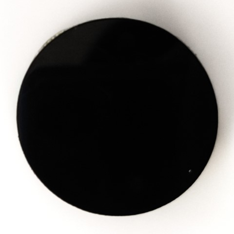
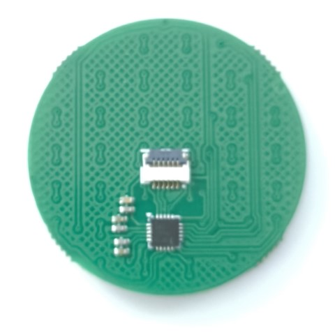

# 低消費電力円形トラックパッド

IQS7211Eを使用した直径30mmのトラックパッドです。低消費電力(~1.5mA)なので無線自作キーボードでの使用に適しています。2点マルチタッチに対応しています。

|||
|-|-|

**[BOOTH](https://nogikes.booth.pm/items/7254791)にて販売中**

## 組立

* 両面テープは基板表面に隙間なく敷き詰めてください。
* アクリルプレートの片面の保護シートをはがし、基板に貼り付けてください。
* もう一面の保護シートは剥がさないほうが操作感が良いです。

## ピン配置

0.5mmピッチ、6ピンのFPCで接続します。 同一電極面のFPCを使う場合、対向する側のコネクタでピン順が反転するので注意してください。

Auto-KDKやtorabo-tsuki LPのコネクタと同一電極面のFPCで接続できます。

|番号|機能|
|-|-|
|1|VCC(1.8~3.3V)|
|2|RDY|
|3|GND|
|4|SCL|
|5|SDA|
|6|GND|

## サンプルプログラム

- [zmk-driver-iqs7211e](https://github.com/sekigon-gonnoc/zmk-driver-iqs7211e)
  - [torabo-tsuki LPに取り付けるサンプル](https://github.com/sekigon-gonnoc/zmk-keyboard-torabo-tsuki-lp/tree/torapa-tsuki)
    - [3dmodels](./3dmodels/)の中のモデルを3Dプリンタで印刷して、本モジュールをtorabo-tsuki LPのボトムプレートに取り付けられます。
    - torapa-tsukiブランチをビルドして書き込んでください。
- [QMK用サンプル](./qmk_firmware)
    - ピン設定はAuto-KDKコントローラに合わせてあります。必要に応じてconfig.hを編集してください。